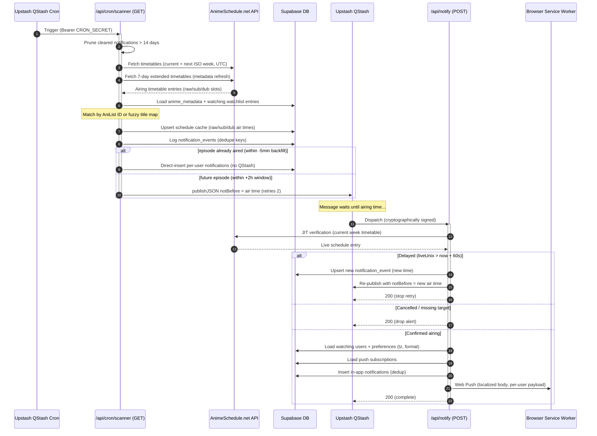
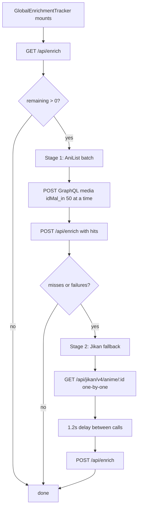

# Aniotako — Architecture

**A personal anime watchlist tracker & airing scheduler.**

This document is a complete, technical deep-dive into the Aniotako codebase — what the
project is, how every subsystem works, the tech stack, the database, the API surface,
the background pipelines, and the operational details. It is intended to be fully
self-contained: no prior knowledge of the codebase is required.

---

## Table of Contents

1. [Project Overview](#1-project-overview)
2. [Tech Stack](#2-tech-stack)
3. [Repository Structure](#3-repository-structure)
4. [Environment Variables](#4-environment-variables)
5. [Database Architecture](#5-database-architecture)
6. [Authentication & Security](#6-authentication--security)
7. [API Reference](#7-api-reference)
8. [Data Access & Client State](#8-data-access--client-state)
9. [Core System Flows](#9-core-system-flows)
10. [Frontend Architecture](#10-frontend-architecture)
11. [SEO & Discoverability](#11-seo--discoverability)
12. [Operational Notes & Known Quirks](#12-operational-notes--known-quirks)

---

## 1. Project Overview

**Aniotako** is a high-performance, premium-feeling web application for anime fans who
want a *private, ad-free* way to:

- Curate a personal watchlist and track episode-by-episode progress.
- Search an anime catalog and filter it dozens of ways (type, status, genre, tag, score,
  season, year, date range, airing status, age rating, language).
- Import an existing **MyAnimeList XML export** and have the app auto-enrich every entry
  with cover art, genres, English/Romaji titles, seasons, and summaries.
- Receive **just-in-time push notifications** when a watched anime's next episode airs —
  with three release formats (raw broadcast, subtitled, dubbed), per-user timezone
  localization, and live delay/cancellation handling.
- Follow a **weekly airing calendar** with per-day release dots and per-show countdowns.

The product posture is *personal and private*: a single-user-oriented experience (guests
can explore; accounts are individual), with strong Row Level Security, no ads, no
analytics, and no media hosting. It is a solo-developer project in active development
(194+ commits at the time of writing), deployed on Vercel at `aniotako.com`.

### Design goals

- **Fast & reactive** — Server Components for data, Client Components for interactivity,
  optimistic UI mutations, client-side caches, infinite scroll, lazy-loaded images.
- **No hidden cost for the developer** — the app aggressively rate-limits upstream APIs
  (AniList, Jikan) using an in-DB semaphore + circuit breaker so public endpoints are
  never hammered.
- **Self-healing pipelines** — the notification pipeline has multiple redundancy layers
  (QStash scheduling, direct DB inserts, a 7-day catch-up scan, JIT verification).
- **SEO-friendly** — rich metadata, JSON-LD structured data, dynamic sitemap, and an
  AI-crawler-friendly `robots.txt`.

---

## 2. Tech Stack

| Layer | Technology | Version | Role |
| :--- | :--- | :---: | :--- |
| **Framework** | Next.js (App Router) | `16.2.1` | Server/Client rendering, Route Handlers, Server Actions surface, middleware |
| **UI** | React | `19.2.4` | Component model; **React Compiler** enabled via `next.config.ts` |
| **Styling** | TailwindCSS | `4.3.2` | Utility-first CSS via `@tailwindcss/postcss` |
| **Database** | Supabase (PostgreSQL) | managed | Primary datastore, Auth, RLS, Realtime channels |
| **ORM / Query** | Prisma | `7.8.0` | Server-side typed access via `@prisma/adapter-pg` + `pg` `Pool` |
| **Auth** | Supabase Auth | `@supabase/ssr 0.9.0`, `@supabase/supabase-js 2.108.2` | Email/password + OAuth identities, session cookies |
| **Scheduling/Queue** | Upstash QStash | `2.11.1` | Cron trigger + scheduled message queue + request signing |
| **Web Push** | `web-push` | `3.6.7` | VAPID-signed browser push delivery + `/sw.js` service worker |
| **Package manager** | Bun | — | `bun.lock`; `npm run build` still runs `prisma generate && next build` |
| **Runtime data (PG)** | `pg` | `8.22.0` | Connection pool feeding the Prisma adapter |
| **Progress bar** | `nextjs-toploader` | `3.9.17` | Client-side route-transition progress indicator (red→rose gradient) |
| **Lint** | ESLint | `9.39.4` | `eslint-config-next/core-web-vitals` + `typescript` |

### External data sources

| Source | Protocol | Used for |
| :--- | :--- | :--- |
| **AniList GraphQL** | `POST https://graphql.anilist.co` | Search, autocomplete, anime detail, metadata enrichment (batched), calendar fallback schedules |
| **Jikan (MAL proxy)** | `GET https://api.jikan.moe/v4/...` | Metadata fallback when AniList misses, episode list for the Episodes tab |
| **AnimeSchedule.net** | `GET https://animeschedule.net/api/v3/timetables` | Weekly airing timetables (Bearer token); the source of truth for the notification pipeline and schedule cache |

### Key configuration files

- `next.config.ts` — sets `reactCompiler: true` (React Compiler enabled for automatic
  memoization).
- `prisma.config.ts` — loads `.env.local`, uses `DIRECT_URL` for migrations.
- `postcss.config.mjs` — Tailwind v4 PostCSS plugin.
- `eslint.config.mjs` — flat config composing `eslint-config-next` core-web-vitals + TS.
- `tsconfig.json` — strict mode, `@/*` → `./src/*` path alias, `moduleResolution: bundler`.

---

## 3. Repository Structure

```
aniotako/
├── src/
│   ├── proxy.ts                  # Next.js middleware (auth gate, header forwarding)
│   ├── app/
│   │   ├── layout.tsx            # Root layout: fonts, metadata, top loader
│   │   ├── globals.css           # Tailwind v4 entry + design system + hero utils
│   │   ├── (app)/                # Authenticated shell (navbar, contexts)
│   │   │   ├── layout.tsx        # Shared nav, TitleLanguage/Watchlist providers
│   │   │   ├── page.tsx          # Homepage (JSON-LD + <HomeClient/>)
│   │   │   ├── watchlist/        # Grid/list of entries + filter panel
│   │   │   ├── search/           # Full catalog search + filter panel
│   │   │   ├── anime/[id]/       # Anime detail (server + rich client)
│   │   │   ├── calendar/         # Weekly airing calendar
│   │   │   ├── import/           # MAL XML import wizard
│   │   │   ├── notifications/    # In-app notification inbox
│   │   │   ├── profile/          # Profile + watch stats
│   │   │   ├── settings/         # All preferences + danger zone
│   │   │   ├── terms/            # ToS (static)
│   │   │   └── privacy/          # Privacy Policy (static)
│   │   ├── api/                  # Route Handlers (see §7)
│   │   ├── auth/callback/        # OAuth / email-link session exchange
│   │   ├── login|signup|forgot-password|reset-password/
│   │   ├── robots.ts / sitemap.ts
│   │   └── icon.svg, apple-icon.png, favicon.ico
│   ├── components/               # Shared UI + feature components (see §10)
│   ├── hooks/                    # useSearchQuery, usePaginatedSearch, useAutocompleteSearch
│   └── lib/
│       ├── prisma.ts             # Prisma client singleton (pg adapter)
│       ├── anime.ts              # getAnimeDetails() w/ semaphore + circuit breaker
│       ├── get-site-url.ts       # Dynamic base-URL resolver
│       ├── timezone.ts           # TZ formatting, abbreviations, countdown math
│       ├── supabase/
│       │   ├── client.ts         # Browser client (anon key)
│       │   ├── server.ts         # Server client + cached user + header fast-path
│       │   └── service.ts        # Service-role client (bypasses RLS)
│       ├── TitleLanguageContext.tsx
│       └── WatchlistContext.tsx
├── prisma/schema.prisma          # Introspected schema (public + auth schemas)
├── prisma.config.ts
├── public/
│   ├── sw.js                     # Service worker: push + notification click
│   ├── icon-192/512.png, logo.svg, background-image.png
│   └── google27dea3c8c48a8da9.html   # Google Search Console verification
├── .env.example                  # Template of all required env vars
├── project.md                    # Feature/marketing overview (sibling doc)
├── notebook/  graphify-out/      # Dev tooling output (not part of runtime)
└── package.json
```

---

## 4. Environment Variables

All variables below are referenced by name in the code. Secrets are only ever available
to the server (the `NEXT_PUBLIC_` prefix exposes a value to the browser).

| Variable | Public | Used in | Purpose |
| :--- | :---: | :--- | :--- |
| `NEXT_PUBLIC_SUPABASE_URL` | ✅ | All Supabase clients | Supabase project URL |
| `NEXT_PUBLIC_SUPABASE_ANON_KEY` | ✅ | Browser + server anon clients | Client-side JWT (RLS-scoped) |
| `SUPABASE_URL` | | `cron/scanner` | Alias used to build the service-role client (falls back to `NEXT_PUBLIC_SUPABASE_URL`) |
| `SUPABASE_SERVICE_ROLE_KEY` | | Service-role clients (`anime.ts`, `enrich`, `scanner`, `notify`, `account/delete`, `watchlist/add`) | Admin client that **bypasses RLS** — never exposed to the browser |
| `NEXT_PUBLIC_VAPID_PUBLIC_KEY` | ✅ | PushToggle/Notifications/Settings | VAPID application server key (converted base64url→Uint8Array) |
| `VAPID_PRIVATE_KEY` | | `api/notify` | VAPID signing key for `webpush.setVapidDetails` |
| `VAPID_SUBJECT` | | `api/notify` | Contact URI; defaults to `mailto:harsh.vs.tech@gmail.com` |
| `CRON_SECRET` | | `cron/scanner`, `fix-completed` | Bearer token / `?secret=` guard for cron endpoints |
| `ANIMESCHEDULE_TOKEN` | | `cron/scanner`, `api/notify` | Bearer token for AnimeSchedule.net API |
| `QSTASH_TOKEN` | | `cron/scanner`, `api/notify` | QStash REST client auth |
| `QSTASH_URL` | | (optional) | Overrides QStash base URL |
| `QSTASH_CURRENT_SIGNING_KEY` / `QSTASH_NEXT_SIGNING_KEY` | | `api/notify` | Used by `verifySignatureAppRouter` for request signing (env-injected by the QStash SDK) |
| `DATABASE_URL` | | `lib/prisma.ts` | Postgres **transaction-mode pooler** connection (`pgbouncer=true`) for the Prisma adapter |
| `DIRECT_URL` | | `prisma.config.ts` | **Session-mode pooler** connection used for `prisma migrate` |
| `NEXT_PUBLIC_SITE_URL` | ✅ | `get-site-url`, layouts, sitemap/robots | Canonical site URL; otherwise resolved from request headers |

---

## 5. Database Architecture

The database is a **Supabase PostgreSQL** project. The Prisma schema
(`prisma/schema.prisma`) is the result of introspection of the live database and spans
**two schemas**:

- `auth` — Supabase-managed tables (`users`, `identities`, `sessions`, `refresh_tokens`,
  `mfa_*`, `webauthn_*`, `oauth_*`, `sso_*`, `flow_state`, `one_time_tokens`,
  `audit_log_entries`, `schema_migrations`). The app never writes here directly except
  through the Supabase Auth admin client (account deletion).
- `public` — application tables, all protected by **Row Level Security (RLS)**.

### 5.1 ER Diagram

```mermaid
erDiagram
    users ||--o| profiles : "id = users.id"
    users ||--o| user_preferences : "one row per user"
    users ||--o{ watchlist_entries : "curates"
    users ||--o{ push_subscriptions : "subscribes"
    users ||--o{ notifications : "receives"
    anime_metadata ||--o{ watchlist_entries : "fk_watchlist_metadata"
    notification_events ||--o{ notifications : "notification_event_id"

    profiles {
        uuid id PK "= auth.users.id"
        text display_name
        timestamptz created_at
    }
    user_preferences {
        uuid user_id PK
        boolean notify_watching_only "default true"
        boolean email_notifications "default false"
        boolean show_adult "default false"
        text title_language "romaji|english"
        text notification_format "raw|sub|dub"
        boolean countdown_enabled "default true"
        text timezone "IANA zone"
        timestamptz updated_at
    }
    watchlist_entries {
        bigint id PK "autoincrement"
        uuid user_id FK
        bigint mal_id FK "anime_metadata"
        text title
        text status "watching/completed/on_hold/dropped/plan_to_watch"
        int score "0-10 or null"
        int watched_episodes "default 0"
        int total_episodes
        text poster_url
        text title_english
        text title_romaji
        timestamptz created_at "UTC"
    }
    anime_metadata {
        bigint mal_id PK
        int anilist_id
        text title, title_english, title_romaji, title_native
        text[] genres "genres + tags merged"
        text type "TV/MOVIE/OVA/ONA/SPECIAL/MUSIC"
        text season, airing_status, studio, synopsis, poster_url, banner_image
        int year, total_episodes
        decimal mean_score
        bigint raw_air_at, sub_air_at, dub_air_at "unix seconds"
        int raw_next_episode_number, sub_next_episode_number, dub_next_episode_number
        bigint next_airing_at "earliest of the three"
        jsonb anilist_raw, jikan_raw, jikan_episodes_raw
        timestamptz cached_at, schedule_updated_at
    }
    notification_events {
        uuid id PK
        text event_key UK "mal_id:episode:format:time"
        bigint anilist_id, mal_id
        int episode_number
        text format "raw|sub|dub"
        timestamptz aired_at
        timestamptz created_at
    }
    notifications {
        uuid id PK "gen_random_uuid()"
        uuid user_id FK
        int mal_id
        text anime_title
        int episode_number
        text poster_url
        boolean is_read "default false"
        boolean is_cleared "soft-delete, default false"
        date created_date "derived from created_at"
        text format "default sub"
        timestamptz aired_at
        uuid notification_event_id FK
    }
    push_subscriptions {
        bigint id PK "autoincrement"
        uuid user_id FK
        text endpoint UK
        text p256dh
        text auth_key
        timestamptz created_at "UTC"
    }
```

### 5.2 Application tables (public schema)

#### `watchlist_entries`
The user's list of anime.
- **Constraints:** `UNIQUE (user_id, mal_id)` prevents duplicates; FK
  `fk_watchlist_metadata` → `anime_metadata.mal_id` (`NO ACTION`). This FK means a
  metadata row **must exist** before a watchlist row can be inserted — the add route
  handles this by creating a stub metadata row when missing.
- **RLS:** owner-only `SELECT`/`INSERT`/`UPDATE`/`DELETE` via `auth.uid() = user_id`.

#### `anime_metadata`
Global cache of scraped/enriched anime details plus the **airing schedule cache**.
- The three `*_air_at` columns (unix seconds) + `*_next_episode_number` columns are
  written by the cron scanner from AnimeSchedule.net and drive countdowns, the calendar,
  and the detail page schedule card.
- `anilist_raw` / `jikan_raw` hold the untouched upstream payloads (used for detail-page
  rendering and for cache-freshness checks).
- **Indexes:** `anilist_id`, partial `airing_status = 'RELEASING'`, partial
  `next_airing_at IS NOT NULL`, `cached_at`.
- **RLS:** readable by all authenticated users; writes reserved for the service-role
  client (client-side `INSERT` has no policy).

#### `notification_events`
Global, deduplicated record of "an episode X of show Y aired in format Z at time T".
- `event_key` is `{mal_id}:{episode}:{format}:{time}` and is `UNIQUE` — this is the
  **deduplication bedrock** of the whole notification pipeline. If the key exists, the
  pipeline will not re-queue or re-deliver.
- **RLS:** internal only (public access revoked).

#### `notifications`
Per-user in-app notifications.
- `UNIQUE (user_id, notification_event_id)` guarantees a user can never receive the same
  event twice (belt-and-braces alongside `notification_events.event_key`).
- Soft delete via `is_cleared`; rows with `is_cleared = true` older than **14 days** are
  hard-deleted by the cron scanner on each run.
- **RLS:** users may `SELECT` (read), `UPDATE` (`is_read`), `DELETE` (clear) their own
  rows; **`INSERT` is intentionally policy-less** — only the service-role cron/notify
  workers insert rows.

#### `user_preferences`
One row per user.
- Defaults: `notify_watching_only=true`, `title_language=romaji`,
  `notification_format=sub`, `countdown_enabled=true`, `show_adult=false`,
  `email_notifications=false` (feature disabled in UI, "Coming Soon").
- A Postgres trigger `handle_new_user_prefs` auto-creates the row at signup; the
  preferences API also lazily creates it on first read (`PGRST116` handling).
- **RLS:** owner-only.

#### `profiles`
Display name / member-since. `id` = `auth.users.id` (1:1).
- **RLS:** owner-only.

#### `push_subscriptions`
Browser Web Push subscription endpoints.
- `endpoint` is `UNIQUE` so re-subscribing on the same device upserts rather than
  duplicates.
- **RLS:** owner-only read/write.

#### `api_status` + `active_api_requests`
Rate-limiting infrastructure for the AniList upstream (see §9.4).
- `api_status.api_name` PK + `blocked_until` = **circuit breaker**. When AniList returns
  HTTP 429, the blocked window is written monotonically with `GREATEST()`.
- `active_api_requests` = **semaphore tickets**. The Postgres function
  `acquire_anilist_semaphore()` (invoked via `supabase.rpc`) atomically checks the
  circuit breaker, counts in-flight tickets, and inserts a ticket row (or denies with
  `rate_limited` / concurrency reasons). Workers delete their ticket on completion.

### 5.3 Row Level Security summary

| Table | Client read | Client write | Insert-by-client |
| :--- | :--- | :--- | :--- |
| `watchlist_entries` | owner | owner | owner |
| `anime_metadata` | any authenticated user | ❌ (service role only) | ❌ (service role only) |
| `user_preferences` | owner | owner | owner |
| `profiles` | owner | owner | owner |
| `push_subscriptions` | owner | owner | owner |
| `notifications` | owner | owner (`is_read`, clear) | ❌ blocked (service role only) |
| `notification_events` | ❌ | ❌ | ❌ (service role only) |
| `api_status`, `active_api_requests` | ❌ (via RPC only) | ❌ | ❌ (via RPC only) |

The **service-role client** (`createServiceClient()` / ad-hoc `createAdminClient`) is the
only path that bypasses RLS and is used strictly server-side: metadata upserts,
notification inserts, cron reads, auth-admin operations, and account deletion.

---

## 6. Authentication & Security

### 6.1 Auth model

Supabase Auth with **email/password** (default) and **OAuth** identities. Sessions are
JWT-based and carried in cookies managed by `@supabase/ssr`:
- **Client:** `createBrowserClient` (`lib/supabase/client.ts`).
- **Server:** `createServerClient` with a cookie adapter over `next/headers` cookies
  (`lib/supabase/server.ts`).

Sign-up uses `emailRedirectTo` pointing at `/auth/callback`, which exchanges the code for
a session (`supabase.auth.exchangeCodeForSession`) and redirects to `?next=` (default
`/watchlist`). Forgot-password redirects to `/auth/callback?next=/reset-password`, and
the reset page verifies the session before allowing `supabase.auth.updateUser({ password })`.

### 6.2 Middleware (`src/proxy.ts`)

This is the security choke point for every request that isn't a static asset.

**Bypass routes** — `/api/notify` and `/api/cron/*` skip auth entirely so background
jobs never stall on a Supabase session lookup.

**Auth verification with a fail-fast timeout:**
- The Supabase client is constructed with a custom `fetch` that injects an
  `AbortController` signal.
- `AUTH_TIMEOUT_MS` is 30 s in development, 6 s in production. If `auth.getUser()`
  doesn't resolve in time, the user is treated as unauthenticated rather than hanging the
  request (prevents slow Supabase from stalling page loads).

**Routing rules:**
- Unauthenticated + `/api/*` (non-cron) → `401 JSON`.
- Unauthenticated + `/settings` or `/profile` → redirect `/login?next={path}`.
- Authenticated + `/login` or `/signup` → redirect `/watchlist`.
- Everything else passes through.

**Header forwarding (the core performance trick):**
The middleware forwards the verified user identity to downstream Server Components and
Route Handlers as request headers:
- `x-auth-checked: true`
- `x-user-id: {id}`
- `x-user-email: {email}` (empty string when logged out)

**Spoof protection:** before setting these headers, the middleware **deletes any inbound
values** — a malicious client cannot inject `x-user-id` to impersonate a user. API routes
and Server Components can therefore trust these headers (via `getAuthUser(req)` /
`getServerUser()`) and skip a second Supabase round-trip.

**Session refresh:** Set-Cookie headers emitted by the Supabase session-refresh flow are
copied from the middleware response onto the final response so cookies stay fresh.

### 6.3 Server-side user helpers (`lib/supabase/server.ts`)

| Helper | Behavior |
| :--- | :--- |
| `createClient()` | SSR client bound to the cookie store |
| `getCachedUser()` | React-`cache()`d `auth.getUser()` for Server Components |
| `getServerUser()` | Reads `x-auth-checked`/`x-user-id`/`x-user-email` headers (set by middleware) and returns immediately; falls back to `auth.getUser()` outside a request context (e.g. build-time) |
| `getAuthUser(req?)` | Same header fast-path, designed for Route Handlers that pass `Request` |

### 6.4 Account deletion (`/api/account/delete`)

A self-service, abuse-hardened flow:
1. **Identity re-verification is done server-side:**
   - The service-role admin client fetches the user to determine account type from
     `user.identities` — the client cannot spoof this.
   - **Email/password accounts:** the user must re-supply their password, which is
     re-validated with `signInWithPassword`.
   - **OAuth accounts:** the user must type their exact account email.
2. **Data deletion:** push subscriptions, notifications, watchlist entries, preferences,
   and the profile row are deleted via the admin client (RLS bypass).
3. **Auth record deletion:** `adminClient.auth.admin.deleteUser()` removes the
   `auth.users` row (cascading to identities/sessions).
4. Best-effort sign-out; the session is invalid regardless because the user record is gone.

### 6.5 Other security notes

- All user-facing APIs verify identity via `getAuthUser(req)` (header fast-path) **and**
  scope every query with `.eq("user_id", user.id)` — ownership is enforced both by RLS
  and by explicit filters (e.g. `watchlist/update` matches on `id` + `user_id`).
- Cron endpoints are gated by `CRON_SECRET` (`Bearer` header for the scanner, `?secret=`
  for `fix-completed`).
- `/api/notify` is protected by **QStash cryptographic signature verification**
  (`verifySignatureAppRouter`), so only genuine QStash dispatches can invoke it.
- The AniList detail fetcher uses a DB-backed semaphore + circuit breaker (see §9.4).
- Rate limiting on "clear all notifications" (60 s cooldown per user, in-memory map).
- `robots.ts` disallows `/api`, `/auth`, `/settings`, and password pages.

---

## 7. API Reference

All endpoints live under `src/app/api/`. User-facing routes authenticate via
`getAuthUser(req)`; cron/worker routes use `CRON_SECRET` or QStash signatures.

| Endpoint | Method | Auth | Description |
| :--- | :---: | :---: | :--- |
| `/api/watchlist/add` | `POST` | Session | Add an anime to the watchlist. Rejects duplicates (409), ensures a stub `anime_metadata` row exists (FK), uses an exponential-backoff retry helper. |
| `/api/watchlist/update` | `PATCH` | Session | Partial update (`{ id, updates }`) of one entry. Ownership enforced by `.eq("user_id")`. |
| `/api/watchlist/delete?id=` | `DELETE` | Session | Remove one entry (ownership-scoped). |
| `/api/watchlist/all` | `DELETE` | Session | Wipe the entire watchlist (Danger Zone). |
| `/api/import` | `POST` | Session | Bulk upsert parsed MAL entries (user_id attached, MAL "completed=0" bug corrected, `title_romaji = title`). |
| `/api/export?format=` | `GET` | Session | Download watchlist as **JSON** (default), **CSV**, or **MAL XML** (round-trip compatible with import). |
| `/api/preferences` | `GET`/`PATCH` | Session | Read/update `user_preferences`. GET lazily inserts a default row if missing (`PGRST116`). |
| `/api/profile` | `POST` | Session | Set `display_name` (max 30 chars, trimmed). |
| `/api/enrich` | `GET`/`POST` | Session | GET: list entries needing enrichment (missing `poster_url` or no cached metadata). POST: accept resolved enrichments, upsert `anime_metadata`, update watchlist posters/titles/episode counts (incl. completed correction). |
| `/api/calendar?start=&end=` or `?date=&week=true` | `GET` | Session | Resolve airing schedules from the DB cache for a range; returns AniList GraphQL query **chunks** for client-side fallback + a `userEntriesMap` (status/progress per show). |
| `/api/subscribe` | `POST`/`DELETE` | Session | Upsert/remove a Web Push subscription (endpoint-unique). |
| `/api/notifications?limit=&unread=` | `GET` | Session | List notifications (soft-delete filtered, newest first), joined with `anime_metadata` for bilingual titles; returns true unread count. |
| `/api/notifications/read-all` | `PATCH` | Session | Mark all unread+uncleared as read (via Prisma). |
| `/api/notifications/{id}/read` | `PATCH` | Session | Mark one notification read (ownership-scoped, via Prisma). |
| `/api/notifications` | `DELETE` | Session | "Clear all" — soft-deletes (`is_cleared=true`) with a 60 s cooldown (429 + `Retry-After`). |
| `/api/account/delete` | `DELETE` | Session | Secure account deletion (§6.4). |
| `/api/cron/scanner` | `GET` | `Bearer CRON_SECRET` | The airing-notification scanner (§9.1). |
| `/api/notify` | `POST` | QStash signature | JIT delivery worker (§9.2). |
| `/api/fix-completed?secret=` | `GET` | `CRON_SECRET` | One-off repair: sets `watched_episodes = total_episodes` for completed entries stuck at 0. |

> Note: earlier versions proxied AniList search/detail through `/api/anilist/*`; the
> current architecture calls the AniList GraphQL API **directly from the client** for
> search/autocomplete and from `lib/anime.ts` on the server for detail pages. There are
> no `/api/anilist/*` routes in the current tree.

---

## 8. Data Access & Client State

### 8.1 Two query paths, used deliberately

| Path | Library | RLS | Used for |
| :--- | :--- | :---: | :--- |
| **Supabase JS** (anon + service role) | `@supabase/supabase-js` | ✅ (anon) / bypass (role) | Most app reads/writes; auth; realtime |
| **Prisma** (`lib/prisma.ts`) | `@prisma/client` + `@prisma/adapter-pg` (pg Pool) | bypasses RLS | Notification read/mark/clear writes and cron pruning |

Prisma is used for `notifications` writes specifically because of a known limitation:
during cron/worker execution there is no active Supabase session, and RLS session
variables (`auth.uid()`) are not populated — so Supabase `UPDATE`s would be filtered out.
Route handlers `api/notifications`, `.../read-all`, `.../[id]/read`, and the scanner's
14-day prune go through Prisma, while everything else (including notification reads
that need joined metadata) uses the Supabase client.

### 8.2 `WatchlistContext` (optimistic mutations)

`WatchlistProvider` seeds a `Map<mal_id, { id, status, score, watched_episodes }>` from
server-rendered initial data, giving **O(1) lookups** app-wide ("is this in my list?",
what status/progress is it in?) so search cards, anime cards, and action sheets never
re-fetch.

Mutations (`addToWatchlist`, `updateWatchlistStatus`, `removeFromWatchlist`) are
**optimistic**: apply the change locally, fire the API call, and on failure **roll back**
— but only if no newer mutation has happened in the meantime (`lastMutationTimestamp`
race guard prevents stale rollbacks clobbering fresh state). `isUpdating` is exposed for
UI spinners.

### 8.3 `TitleLanguageContext`

Holds `title_language` (`romaji` | `english`), loaded from `user_preferences`. Exposes
`getTitle(entry)` which returns the preferred title with a fallback chain
(`romaji → english → title`). Everywhere titles render (cards, search, bell, calendar,
detail page) they go through this helper so the preference is honored globally.

### 8.4 Search hooks & caching

`useSearchQuery` wraps the AniList GraphQL calls for both paginated search
(`SEARCH_QUERY`) and autocomplete (`AUTOCOMPLETE_QUERY`). Fetchers are memoized with
`useCallback` and back a module-level `cacheMap` with a **5-minute TTL** keyed by
serialized filters/query — so repeat searches are instant and cheap on AniList quota.
Both accept an `AbortSignal` (stale requests abort cleanly).

- `usePaginatedSearch` — full search page; **URL search params are the single source of
  truth**; filter changes rewrite the URL via `history.replaceState` (dropping empty
  params and resetting to page 1).
- `useAutocompleteSearch` — navbar/home hero autocomplete; 350 ms debounce, results
  capped at 8, full keyboard navigation (arrows wrap, Home/End, Escape, Enter, Ctrl/Cmd
  for new tab).

### 8.5 Client-side preferences (`localStorage`)

| Key | Purpose |
| :--- | :--- |
| `aniotako_timezone` | Timezone override used by `lib/timezone.ts` |
| `aniotako_view` | Grid vs List preference |
| `aniotako_sort` | Watchlist sort (restored by `WatchlistFilter`) |
| `aniotako_push_subscribed` | Push-subscribed flag used by the notification toggle |

---

## 9. Core System Flows

### 9.1 The Just-In-Time (JIT) Airing Notification Pipeline

This is the heart of the product. It runs on a schedule, matches an external timetable
against user watchlists, and delivers Web Push + in-app notifications at (approximately)
the exact airing moment, with live delay/cancellation handling.

**Orchestration overview:**



#### Scanner internals (`/api/cron/scanner`)

1. **Guard:** requires `Authorization: Bearer CRON_SECRET`.
2. **Prune:** hard-deletes `notifications` where `is_cleared = true` and older than
   14 days (via Prisma).
3. **Window:** the notification window is **past 5 minutes → future 2 hours**
   (`windowStartUnix`, `windowEndUnix`), computed in UTC to avoid timezone drift.
4. **Week math:** an ISO-week/year helper computes the current week and the next week
   (if the window crosses a week boundary) in UTC.
5. **Fetch timetables:** pulls `https://animeschedule.net/api/v3/timetables?week=&year=&tz=UTC`
   for the window weeks, **plus** every week spanned by the next 7 days (a metadata
   refresh so detail-page "next episode" info stays fresh even for shows airing days away).
6. **Load context:** fetches all `anime_metadata` rows with a non-null `anilist_id`
   (up to 10,000) and all `watchlist_entries` with `status = 'watching'`.
7. **Matching engine:**
   - *ID pass:* extracts an AniList ID from each timetable show — checking keys
     (`anilistId`, `mediaId`, `animeId`, …) and deep-searching the payload strings/URLs
     for `anilist.co/anime/{id}` patterns.
   - *Title pass:* if no ID, normalizes every candidate title field (English, Romaji,
     native, nested objects) and looks it up in a normalized `title → anilistId` map
     built from the cached metadata.
   - Finished/cancelled shows are excluded to avoid stale-schedule collisions.
8. **Group & merge:** timetable entries for the same anime are grouped by AniList ID.
   A `pickBetter()` comparator selects the *earliest future* air time (falling back to
   the *most recent past*) per format so "next episode" is always the right one.
   `sub_air_at` falls back to `raw_air_at`; dub episode numbers default to
   `raw - 1` (min 1); `next_airing_at` = earliest non-null of the three.
9. **Cache upsert:** batches of 100 upsert the schedule fields into `anime_metadata`
   (`onConflict: "mal_id"`). Finished shows get all airing fields cleared.
10. **Candidate compilation:** for each *actively-watched* show, builds a candidate per
    format (`raw`/`sub`/`dub`) that falls in the window. Each candidate gets an
    `event_key = {mal_id}:{episode}:{format}:{time}`.
11. **Deduplication:** existing `event_key`s are queried from `notification_events`
    (chunked by 500); anything already present is skipped.
12. **Direct insert (already aired):** candidates that already aired are delivered
    **immediately**, bypassing QStash (QStash adds latency for past episodes and can
    silently fail). For each watching user it applies the format fallback chain
    (`raw→raw`, `sub→sub|raw`, `dub→dub|sub|raw`), skips episodes that aired *before*
    the watchlist entry was created, and dedupes against already-delivered
    `(user_id, notification_event_id)` pairs. Batches of 100 upsert into
    `notifications`.
13. **QStash scheduling (future):** candidates in the future are published to QStash in
    batches of 50 (`Promise.allSettled` over concurrent batch workers) with
    `notBefore = air time` and `retries: 2`. The body carries the full dispatch payload
    (IDs, route, episode, format, scheduled time, title, poster).
14. **7-day catch-up (redundancy layer):** because QStash delivery can silently fail and
    the scanner may have missed a real-time window, the scanner:
    - *Step 8a:* ensures `notification_events` rows exist for **all** past watched
      episodes from the last 7 days of timetable data (so delivery never has a missing
      event to key on), and
    - *Step 8:* re-scans every aired event in the last 7 days and inserts any
      per-user notification that wasn't delivered (with the format fallback chain, the
      episode-after-created check, per-event and per-episode dedupe, and a guard that
      skips finished/cancelled shows).
15. **Metrics:** returns `{ shows_scanned, watched_anilist_ids, matched_shows,
    in_window, queued: {raw, sub, dub}, cache_updated, direct_notifications_created }`.

#### Notify worker internals (`/api/notify`)

Invoked only by QStash with a valid signature (`verifySignatureAppRouter`).

1. **Parse payload** (anilist_id, mal_id, route, episode, format, scheduled_at, title,
   poster_url).
2. **JIT verification:** re-fetches the *current* week's timetable from AnimeSchedule.net
   and locates the live entry by `route` or exact `title`, matching format and episode
   (with a format-agnostic fallback match).
3. **Timestamp extraction:** reads the format-appropriate timestamp from the live entry
   (`episodeDate`/`rawPostDate`/`subPostDate`/`dubPostDate`/…). If the timetable carries
   no date, it **scrapes** `https://animeschedule.net/anime/{route}` and regex-extracts
   the JSON fields (`rawPostDate`, `subAirAt`, `dubAirAt`, …).
4. **Decision:**
   - *Cancelled / missing target* → return 200 (drop, no retry).
   - *Delayed* (`liveUnix > now + 60s`) → upsert a new `notification_events` row with the
     corrected timestamp, re-publish the exact same message to QStash with
     `notBefore = liveUnix`, return 200 (so the original dispatch stops retrying).
   - *Confirmed airing* → proceed to dispatch.
5. **Dispatch:**
   - Looks up the global `notification_events.id` by `event_key`.
   - Loads all `watching` users for the anime, their `user_preferences`
     (`notification_format`, `timezone`).
   - Determines which formats are *available* for this episode across events, then
     resolves the **format fallback chain** per user: raw→`RAW`;
     sub→`SUB` or `RAW (Sub not yet available)`; dub→`DUB` or `SUB (Dub not yet
     available)` or `RAW (Dub & Sub not yet available)`. Null means "don't deliver this
     event to this user."
   - Skips users whose watchlist entry was created *after* the episode aired.
   - **Per-user localization:** formats the body with the user's timezone via
     `Intl.DateTimeFormat`, e.g.
     `[SUB] Episode 12 of [Anime] aired at Aug 16, 5:30 PM. Notified at 5:32 PM.`
   - Dedupes against already-delivered notifications for this event.
   - Inserts the in-app `notifications` row (upsert on
     `user_id,notification_event_id`).
   - Sends **Web Push** to every subscription for that user with `webpush.sendNotification`
     (payload includes `url: /anime/{mal_id}`, aired/received timestamps, format,
     episode, title, icon). Subscriptions returning **404/410** are deleted (expired
     endpoints get cleaned automatically).
   - Runs DB inserts and all push sends concurrently.
6. **Errors:** a real failure returns 500 so QStash retries (up to the 2 configured
   retries); handled "no-op" cases always return 200 to stop retries.

### 9.2 Hybrid Metadata Enrichment

When a watchlist is imported or a new anime is added, entries need cover art, genres,
titles, seasons, and summaries. To avoid hammering upstream APIs from the server, this
work is **distributed to the client** as a background task:



- The tracker polls `GET /api/enrich`, which returns entries lacking a `poster_url` or a
  cached metadata row.
- **Stage 1:** chunks of 50 MAL IDs are sent to AniList GraphQL
  (`Media(idMal_in: [...])`); found shows are mapped (HTML stripped from synopsis, main
  animation studio picked, poster/season/year/episodes resolved) and saved via
  `POST /api/enrich`.
- **Stage 2:** the remainder go to Jikan **one at a time with a 1.2 s throttle** (Jikan's
  public API is ~3 req/s). Unknowns/404s are cached as minimal `{ title, type: "Unknown" }`
  rows so they aren't retried every run.
- `POST /api/enrich` upserts metadata, updates the watchlist rows (posters, bilingual
  titles, `total_episodes`), and applies the "completed show stuck at 0 episodes"
  correction.
- A `beforeunload` handler warns if the user closes the tab mid-sync; on completion the
  page refreshes to show enriched artwork.

### 9.3 MAL XML Import

- The XML file is parsed **entirely in the browser** with `DOMParser` (never uploaded).
- Entries map `my_status` → internal statuses and carry score, watched episodes, total
  episodes, and a synthesized `created_at`.
- **Known MAL export bug:** completed shows sometimes export with `0` watched episodes —
  the importer (and `/api/import`, and `/api/fix-completed`) coerces these to the known
  `total_episodes`.
- The importer upserts to Supabase `watchlist_entries` (on `user_id,mal_id`) in chunks
  (ImportClient batches of 50 via `/api/import`), shows per-status count cards and a
  progress bar, then fires a global `trigger-enrichment` event to kick off §9.2.
- The **export** feature round-trips to JSON / CSV / **MAL XML** so users can migrate
  back to MAL if desired.

### 9.4 Anime Detail Caching + AniList Rate Limiting

`getAnimeDetails(malId)` (`lib/anime.ts`) is the server-side fetcher for the anime
detail page:

1. **Cache check:** reads `anime_metadata`. Stale if `cached_at` is older than 7 days —
   or **24 hours** for `RELEASING` shows (schedules change fast) — or if the cached
   `nextAiringEpisode.airingAt` has already passed.
2. **Semaphore:** calls the Postgres RPC `acquire_anilist_semaphore()`, which atomically
   consults the `api_status` circuit breaker, enforces a concurrency cap, and writes a
   ticket to `active_api_requests`. Denial surfaces as `{ error: "rate_limited" }`.
3. **Fetch:** calls AniList with a **10 s AbortController timeout**. On HTTP 429, the
   `blocked_until` circuit breaker is updated monotonically (`GREATEST`) and the client
   gets `{ error: "rate_limited", retryAfter }` so the UI can fall back gracefully.
4. **Cache write:** merges genres + tags, strips HTML from the synopsis, picks the main
   animation studio, and upserts the full row (clearing schedule fields for
   finished/cancelled shows).
5. **Cleanup:** the semaphore ticket is always deleted in a `finally` block.

If the server call fails, `AnimeDetailClient` falls back to a **client-side** AniList
GraphQL POST with an embedded detail query, so the page still renders under rate limits
or network errors.

### 9.5 Calendar Schedule Resolution

- `/api/calendar` accepts either a `start`/`end` unix range or a `date` + `week` flag
  (UTC Monday–Sunday for week mode).
- For each active (non-completed/non-dropped) watchlist entry it checks the cached
  `raw_air_at` / `sub_air_at` / `dub_air_at` fields; if one falls inside the requested
  range, that schedule is resolved **from the database cache** (trusted over AniList,
  even when slightly stale).
- Entries with **no cached schedule at all** for non-finished shows are collected and
  returned to the client as **AniList GraphQL query chunks** (50 per chunk) that the
  browser executes in parallel and merges in.
- The response also includes a `userEntriesMap` so the client can overlay the user's
  status/progress on every calendar card, and week-dot queries run once per visible week.

---

## 10. Frontend Architecture

### 10.1 Rendering pattern

Every page follows the same split:

- **Server component (`page.tsx`)** — auth check, Supabase/Prisma data fetching,
  `generateMetadata`, JSON-LD. Force-dynamic where user data is involved.
- **Client component (`*Client.tsx`)** — interactivity, client-side API calls, rich UI.

Guest users see a reusable `FeatureLandingPage` (benefits + sign-in CTA) for
calendar/import/notifications; the watchlist shows a guest banner; anime detail shows a
"Sign in to Track" card. This gives the site a browsable public surface while keeping
all personal data behind auth.

### 10.2 Pages

| Route | Server | Client | Notes |
| :--- | :--- | :--- | :--- |
| `/` | `page.tsx` (JSON-LD SoftwareApplication) | `HomeClient` | Full-screen spider-lily hero, autocomplete search (AniList), keyboard navigation |
| `/watchlist` | `page.tsx` (joined `anime_metadata`) | `WatchlistClient` | `WatchlistFilter`, `AnimeCard` grid, infinite scroll (+30), remove, floating add button |
| `/search` | thin wrapper | `SearchClient` | Full catalog search + deep filter panel + pagination (via `usePaginatedSearch`) |
| `/anime/[id]` | `page.tsx` (`getAnimeDetails`, prefs, JSON-LD) | `AnimeDetailClient` | Banner hero, Raw/Sub/Dub schedule slots with **per-second countdowns**, genres/tags, synopsis, TrackingCard, tabs (Related/Recommendations/Episodes/Characters/Trailer); Episodes tab lazily fetches Jikan with 429 retry |
| `/calendar` | guest-gated | `CalendarClient` | Monday–Sunday strip, release dots, date picker, status-colored entries |
| `/import` | guest-gated | `ImportClient` | Drag-and-drop MAL XML, status preview, batch POST `/api/import`, triggers enrichment |
| `/notifications` | server query + metadata join | `NotificationsClient` | Time-bucketed inbox, mark read/all-read, clear-all (with 429 cooldown) |
| `/profile` | stats computed server-side | + `EditProfileModal` | Avatar, stats grid (total/total episodes/hours watched/mean score), score-distribution bar chart, favorites |
| `/settings` | thin wrapper | `SettingsClient` (1044 lines) | Everything in §10.4 |
| `/terms`, `/privacy` | static | — | Full legal docs (DPDP Act 2023, IT Act §79, Lucknow governing law) |
| `/login`, `/signup`, `/forgot-password`, `/reset-password` | client | — | Supabase auth flows, sanitized `?next=` redirects |

### 10.3 Key components

| Component | Responsibility |
| :--- | :--- |
| `AnimeCard` | Poster card: status badge, star score (0–10), overflow menu (statuses + remove, mobile bottom-sheet via `ActionSheet`), progress `+`/`-` stepper with auto-"Complete?" prompt at the final episode; optimistic updates to `/api/watchlist/update` |
| `NotificationBell` | Navbar bell; polls `/api/notifications`, subscribes to a **Supabase Realtime** channel on `notifications` for live INSERTs; mark-read / mark-all; unread badge |
| `PushToggle` / `NotficationToggle` | Web Push enable flow: permission → register `/sw.js` → convert VAPID key → `pushManager.subscribe` → `POST /api/subscribe` (persists `aniotako_push_subscribed`) |
| `GlobalEnrichmentTracker` | The §9.2 background enrichment pipeline UI (fixed bottom-left progress card) |
| `WatchlistFilter` | Pure client-side filter/sort: type, status, airing status, score, season, year, date range, genre (AND-matching), 4 sort modes; restores sort from localStorage |
| `SearchBox` / `SearchAutocomplete` / `SearchResultRow` / `SearchAnimeCard` | Search input, autocomplete dropdown (keyboard nav), list rows & grid cards with add/status/remove via `useWatchlist` |
| `ActionSheet` | Mobile bottom sheet (portal) used for watchlist statuses |
| `ConfirmModal` | Portal dialog (Escape/backdrop close, body scroll lock, destructive styling) — used for delete-all, adult toggle, etc. |
| `AsyncButton` | Reusable async button state machine (idle→loading→success/error) |
| `MobileNavDrawer` | Slide-in hamburger drawer with all links |
| `NavbarAuth` / `UserDropdown` / `SignOutButton` / `UserAvatar` | Auth-aware navbar right side; dropdown with Help flyout (Terms/Privacy); Gang-of-Three avatar |
| `Logo` / `Footer` / `FeatureLandingPage` | Branding & marketing pieces |

### 10.4 Settings surface (`SettingsClient`)

- **Account:** display name (30-char limit via `/api/profile`), read-only email,
  change-password link.
- **Notifications & Display:** Web Push enable/disable (subscribe + `/api/subscribe`,
  unsubscribe + `/api/subscribe` DELETE), "Email Notifications — Coming Soon" (disabled),
  Strict Notifications toggle (`notify_watching_only`), **Notification Format**
  raw/sub/dub segmented control, **Countdown Timer** toggle, **Timezone** selector
  (14 hand-picked zones with live clock preview) — all persisted via
  `PATCH /api/preferences`.
- **List Preferences:** Title Language (English/Romaji), Default View (Grid/List),
  Default Sort, **18+ Adult Content** toggle gated behind an age-verification
  `ConfirmModal`.
- **Data & Backup:** Export JSON / CSV / MAL XML via `/api/export`.
- **Danger Zone:** Delete All Entries (type `DELETE`), Delete Account (two-step modal
  requiring `DELETE MY ACCOUNT` + password or email; calls `/api/account/delete`, clears
  localStorage, signs out).

### 10.5 Design system

- **Dark theme:** near-black `#09090b` background, zinc text, red/rose accent gradient
  (`#dc2626 → #f43f5e`) used on CTAs, the top loader, and active states; cyan used for
  calendar release dots/accents.
- **Fonts (via `next/font/google`):** Geist Sans/Mono, Space Grotesk, Plus Jakarta Sans
  (primary sans), Playfair Display (serif), Outfit (display), JetBrains Mono, and
  UnifrakturMaguntia (`--font-gothic`), plus a custom `@font-face` "Gang of Three"
  retro font for the avatar.
- **Utilities:** custom dark scrollbars, `.custom-scrollbar`, hero section classes
  (`.hero`, `.hero__bg`, `.hero__overlay`, `.hero__content`) with responsive
  min-heights for the homepage background image.
- **Icons:** inline SVGs (no icon library). Logo is a hand-authored ~92 KB SVG (octopus,
  sword, spider lily).
- **State/UI conventions:** optimistic updates with rollback, portal-based modals and
  sheets, `nextjs-toploader` for route transitions, skeleton loading states, relative
  timestamps, and `Intl`-based timezone formatting.

---

## 11. SEO & Discoverability

| Asset | Details |
| :--- | :--- |
| **`sitemap.ts`** | Static routes + up to **2,000** dynamic `/anime/{mal_id}` URLs generated from `anime_metadata` via Prisma (with a 3-second timeout fallback to static-only). Sorted by airing status (RELEASING first) then popularity; RELEASING pages get priority 0.7, others 0.5; weekly change frequency. |
| **`robots.ts`** | Default rule (allow all; disallow `/api`, `/auth`, `/settings`, password pages) **plus** a dedicated AI-crawler rule (GPTBot, ChatGPT-User, PerplexityBot, ClaudeBot, anthropic-ai, Applebot, Google-Extended) that explicitly allows `/`, `/anime/`, `/calendar`, `/search` for citation while blocking `/api`, `/auth`, `/settings`. Declares the sitemap. |
| **JSON-LD** | Homepage: `SoftwareApplication` (free offer, feature list). Anime detail: `TVSeries`/`Movie` (aggregate rating, studio), `BreadcrumbList`, and `FAQPage` (next-episode airing, rating, synopsis). |
| **Metadata** | Per-page `generateMetadata` with canonical URLs, OG, and Twitter cards; root metadata base from `NEXT_PUBLIC_SITE_URL`. |
| **Verification** | Google Search Console ownership file in `public/`. |

---

## 12. Operational Notes & Known Quirks

### 12.1 Background scheduling

- **Cron:** Upstash QStash schedules `GET /api/cron/scanner` with the `CRON_SECRET`
  bearer token. QStash both *triggers* the scan and *hosts* the delayed message queue
  that invokes `/api/notify` at air time.
- **Retries:** `notify` messages are published with `retries: 2`; genuine worker failures
  return HTTP 500 so QStash retries, while all "intentional no-op" outcomes return 200.
- **Vercel timeouts:** enrichment throttling (Jikan 1.2 s spacing, max fallbacks) and
  AbortController timeouts (AniList 10 s, Jikan fetches, middleware auth 6 s) keep
  requests inside serverless execution limits.

### 12.2 Why three redundancy layers for notifications?

The pipeline is defensive because a *single* failed path previously caused missed or
duplicate alerts:

1. **QStash scheduled delivery** for future episodes.
2. **Scanner-direct insert** for episodes that aired within the last 5 minutes (QStash
   adds latency for already-aired episodes and can silently fail).
3. **7-day catch-up scan** that ensures `notification_events` exist for every past aired
   episode and backfills any undelivered per-user notifications.

Deduplication is layered the same way: `notification_events.event_key` (global), the
`UNIQUE (user_id, notification_event_id)` constraint (per user), per-event and
per-episode delivery checks, and the "aired after you started watching" guard.

### 12.3 Historical fixes worth knowing (from git history)

- **RLS session breaks on worker writes** → notification writes moved to Prisma
  (which connects with the Postgres pool directly and isn't subject to RLS session
  variables).
- **JIT verification drops** → matching switched to `route`/`title` instead of relying
  solely on AniList IDs that the timetable may not expose.
- **Calendar timezone mismatch** → all week/date math is done in strict UTC and ISO
  week/year helpers are shared between scanner and notify.
- **MAL "completed = 0 episodes" export bug** → corrected at import time, at
  enrichment time, and by the standalone `/api/fix-completed` repair route.
- **Hotlink-blocked poster images** → notification and calendar code prefers the
  database's AniList CDN poster URLs over AnimeSchedule's `imageVersionRoute` URLs,
  which some browsers/regions hotlink-block.
- **Middleware auth latency** → auth moved into `proxy.ts` with header-based user
  forwarding + a hard timeout, so Server Components don't each pay a Supabase round-trip.
- **Stale schedule display** → the scanner extended its fetch window to 7 days so anime
  detail pages always show the correct upcoming episode, not just what falls in the
  ±2-hour notification window.
- **Duplicate/backlog notification waves** → event-key upserts with
  `ignoreDuplicates: true` and constraint-based upserts on `notifications`.

### 12.4 Local development

```bash
bun install          # or npm install
bun run dev          # = NODE_OPTIONS=--dns-result-order=ipv4first next dev
bun run build        # = prisma generate && next build
bun run lint         # = eslint
```

- `--dns-result-order=ipv4first` on dev forces IPv4 DNS ordering (avoids `::1`/`ipv6`
  connection issues with local Supabase/pg).
- Prisma config loads `.env.local` first, then `.env`; migrations use `DIRECT_URL`
  (session-mode pooler), runtime uses `DATABASE_URL` (transaction-mode pooler).

### 12.5 Security posture summary

- RLS on **every** public table; service-role credentials exist only server-side.
- Middleware strips spoofable identity headers before forwarding verified ones.
- QStash signature verification on the only externally-callable worker route; `CRON_SECRET`
  on cron routes.
- Ownership enforced twice (RLS + explicit `.eq("user_id", ...)` filters).
- No analytics, no ads, no third-party tracking; a privacy policy documenting data
  handling under India's DPDP Act 2023 and IT Act §79 intermediary protection.

---

*End of architecture document. For a feature-focused overview, see `project.md`.*