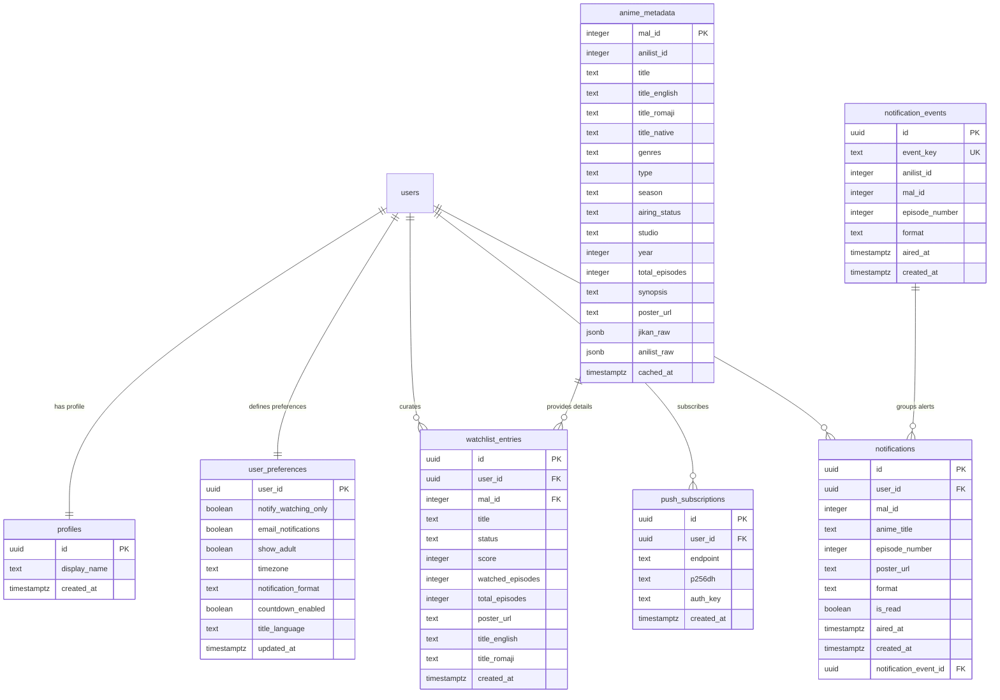
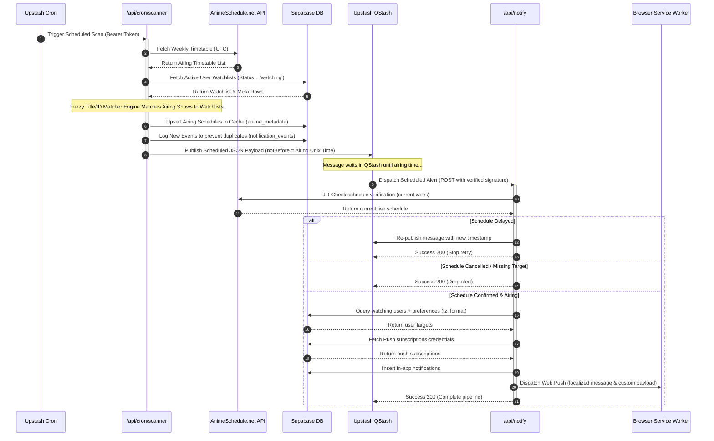

# Aniotako - Personal Anime Watchlist Tracker & Scheduler

Aniotako is a high-performance, premium web application built with **Next.js 16**, **React 19**, **TailwindCSS v4**, and **Supabase**. It functions as a private, ad-free database to track anime watchlists, manage watching progress, and receive real-time push notifications when new episodes air.

---

## 📖 Table of Contents
1. [Core Features](#-core-features)
2. [Database Schema & Architecture](#-database-schema--architecture)
3. [API Reference & Routing](#-api-reference--routing)
4. [System Flows & Logic](#-system-flows--logic)
5. [Tech Stack & Architecture](#-tech-stack--architecture)

---

## ✨ Core Features

### 1. Watchlist Management & UI
*   **Dual View Layouts**: Seamless toggle between a highly aesthetic **Grid View** (featuring rich artwork posters, progress bars, and quick score overlays) and a clean **List View**.
*   **Progress Tracking**: One-click increment (`+`) and decrement (`-`) buttons to update watched episodes. Auto-completes watchlist status with user confirmation upon reaching the final episode.
*   **Star Rating System**: Assign ratings from `1` (Appalling) to `10` (Masterpiece) directly from the card interfaces.
*   **Dynamic Sorting**: Custom sort your watchlist by *Last Updated*, *Title (A-Z)*, *Score (High-Low)*, and *Episode Progress*.

### 2. Advanced Search & Filtering
*   **AniList Search Integration**: Lightning-fast search queries directly proxied through the AniList GraphQL API, complete with infinite scroll pagination.
*   **Comprehensive Client Filters**: Filter watchlists by type (*TV, Movie, OVA, ONA, Special, Music*), status (*Watching, Completed, On Hold, Dropped, Plan to Watch*), airing status (*Releasing, Finished, Not yet released, Cancelled*), scores, seasons, years, and specific date ranges.
*   **Detailed Genre & Tag Filtering**: Over 40 primary genres (*Action, Adventure, Isekai...*) and over 150 advanced tags (*Anti-Hero, Battle Royale, Cyberpunk, Reincarnation...*).

### 3. XML Watchlist Import & Background Enrichment
*   **MyAnimeList XML Import**: Drag-and-drop or select standard XML files exported from MAL. Parses and maps statuses and scores instantly in the browser.
*   **MAL Completed-Show Correction**: Fixes the common MAL export bug where completed shows are downloaded with `0` watched episodes by automatically mapping them to the total episode count.
*   **Hybrid Metadata Enrichment**: Once imported, a background enrichment pipeline (`/api/enrich`) fetches cover art, genres, English/Romaji titles, season details, and summaries. It prioritizes the **AniList GraphQL API** (batch fetches up to 50 shows) and falls back to **Jikan API** (MyAnimeList proxy) for missing items, respecting API rate limits and Vercel timeout guards.

### 4. Just-In-Time (JIT) Airing Notifications
*   **Periodic Timetable Scans**: A cron scanner route (`/api/cron/scanner`) runs regularly via **Upstash QStash**, fetching weekly schedules from `AnimeSchedule.net`.
*   **Fuzzy Matching Engine**: Matches airing schedules to user watchlists using exact AniList IDs or deep fuzzy title checks (English, Romaji, Native, and metadata strings).
*   **QStash Message Queue**: Schedules messages on Upstash QStash matching exact airing times, preventing premature alerts.
*   **JIT Timetable Verification**: Before sending notifications, `/api/notify` performs a live check on `AnimeSchedule.net` to verify if the episode was delayed, rescheduled, or cancelled:
    *   *Delayed*: Reschedules itself in QStash to the new airing time.
    *   *Cancelled*: Aborts the alert.
    *   *On-time*: Dispatches push notifications.
*   **Localized Notifications**: Uses the user's selected timezone to format absolute airing times and delivery timestamps. Sends web push notifications via service workers (using VAPID keys) and populates the in-app notification bell database.

### 5. Highly Tailored User Preferences
*   **Title Language Selector**: Choose preferred displaying title style globally between **English** and **Romaji**.
*   **Timezone Selector**: Override auto-detected browser timezones with standard global timezone zones (e.g., IST, JST, EST, CET, etc.).
*   **Notification Formats**: Choose what episode releases trigger alerts:
    *   `raw`: Notify when the raw broadcast airs in Japan.
    *   `sub`: Notify when English subtitles are ready (Recommended).
    *   `dub`: Notify when the English dub is released.
*   **Countdown Timers**: Option to toggle live airing countdown timers on watchlist cards and detail pages.
*   **NSFW/18+ Toggle**: Control adult content visibility in search queries.

---

## 🗄️ Database Schema & Architecture

Aniotako uses PostgreSQL hosted on **Supabase** with **Row Level Security (RLS)** active on all tables. 

### Table Details & Security

1.  **`watchlist_entries`**: Stores users' anime records. 
    *   *Constraint*: Unique on `(user_id, mal_id)` to prevent duplicates.
    *   *Security*: RLS limits `SELECT`, `INSERT`, `UPDATE`, and `DELETE` access to the record owner (`auth.uid() = user_id`).
2.  **`anime_metadata`**: Cache table storing scraped metadata.
    *   *Security*: Readable by all authenticated users. Writes/updates are reserved for internal backend routines using the Supabase Service Role.
3.  **`push_subscriptions`**: Holds browser endpoint details for Web Push.
    *   *Security*: Managed directly by the subscribing user.
4.  **`user_preferences`**: Contains user-specific settings. A Postgres trigger (`handle_new_user_prefs`) automatically inserts a default configuration row upon user signup.
    *   *Security*: Managed entirely by the owning user.
5.  **`notifications`**: Contains in-app alerts sent to users. 
    *   *Security*: Users can `SELECT` (read), `UPDATE` (mark read), or `DELETE` (clear) their own notifications. Client `INSERT` is blocked (no policy exists); only the service role cron execution can insert rows.
6.  **`notification_events`**: Relational event tracking table.
    *   *Constraint*: Unique on `event_key` (formatted as `mal_id:episode:format:time`) to prevent duplicate worker dispatches.

---

## 🔌 API Reference & Routing

The system uses standard Next.js Route Handlers. All user-facing APIs enforce token verification or Supabase session validation.

| Endpoint | Method | Auth Required | Description |
| :--- | :--- | :---: | :--- |
| `/api/watchlist/add` | `POST` | Yes | Adds a new anime entry to the user's watchlist. Prevents duplicates. |
| `/api/watchlist/update` | `PATCH` | Yes | Updates progress, score, or status of an existing entry. Enforces ownership check. |
| `/api/watchlist/delete` | `DELETE` | Yes | Removes a specific anime from the user's watchlist. |
| `/api/watchlist/all` | `DELETE` | Yes | Wipes the entire user's watchlist (Danger Zone). |
| `/api/import` | `POST` | Yes | Bulk imports MyAnimeList parsed entries and upserts them. |
| `/api/export` | `GET` | Yes | Exports the user's full watchlist as a downloadable JSON file. |
| `/api/preferences` | `GET` / `PATCH` | Yes | Fetches or updates database settings (format, countdown, timezone). |
| `/api/profile` | `POST` | Yes | Updates user display name. Enforces a 30-character limit. |
| `/api/anilist/search` | `GET` | Yes | Queries the AniList GraphQL API. Filters results based on user's NSFW settings. |
| `/api/anilist/anime/[id]` | `GET` | Yes | Retrieves full anime details. Returns cached database metadata if fresh (< 7 days), else fetches from AniList and caches it. Combines historical episode data from Jikan. |
| `/api/calendar` | `GET` | Yes | Fetches airing events for user watchlist. Querying with `week=true` returns dots for calendar display. |
| `/api/subscribe` | `POST` | Yes | Saves Web Push subscription credentials (`endpoint`, `p256dh`, `auth_key`). |
| `/api/cron/scanner` | `GET` | Bearer Token | Scans AnimeSchedule.net weekly timetable, matches watchlists, caches schedule meta, and queues alerts in QStash. |
| `/api/notify` | `POST` | QStash Signature | Processes queued QStash alerts. JIT verifies schedule, logs events, dispatches Web Push & in-app notifications. |

---

## ⚙️ System Flows & Logic

### 1. The Airing Notification Pipeline

This flowchart outlines the cron scanner and QStash execution loop that delivers JIT notifications.

### 2. Hybrid Metadata Enrichment Logic
When a watchlist is imported or a new anime is added:
1.  Check if metadata already exists in the database.
2.  If missing, check **AniList**. Since AniList GraphQL handles batched requests, it packs missing IDs and pulls them in a single network round-trip.
3.  If a show is not found on AniList (e.g., mismatched IDs), the server triggers a **Jikan Fallback** call.
4.  Because Jikan relies on public endpoints with strict rate limits, the handler restricts Jikan fallbacks to a maximum of **5 requests per batch** and employs a **1.1-second throttle delay** between requests to prevent Vercel server timeouts.
5.  All gathered metadata is upserted to `anime_metadata`, and the user's watchlist entries are populated with updated poster URLs and English/Romaji titles.

---

## 🛠️ Tech Stack & Architecture

*   **Next.js 16 (App Router)**: Serves as the React framework, leveraging Server Actions, SSR, and dynamic API Route Handlers.
*   **React 19**: Frontend UI rendering library.
*   **TailwindCSS v4**: Modern CSS utility compilation for lightning-fast, premium styling.
*   **Supabase (PostgreSQL)**: Managed database, user authentication, and Row Level Security policies.
*   **Upstash QStash**: Message queuing and cron scheduling infrastructure, executing verified cryptographic signature handshakes.
*   **Web Push (VAPID)**: Standardized browser push mechanism to deliver alerts even when the browser application is closed.
*   **NProgress**: Client-side progress indicator visualizer for smooth routing transits.
